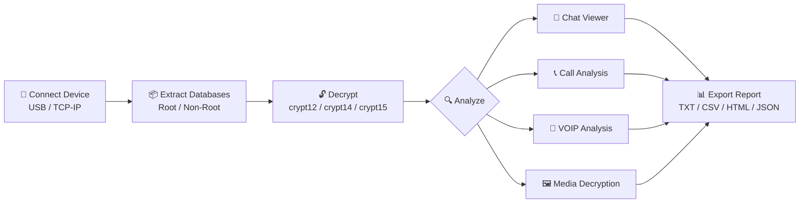

<p align="center">
  
</p>

<h1 align="center">⚡ WhatsApp Forensicator v2.0 — WhatsApp Forensics Tool for Windows ⚡</h1>

<p align="center">
  <strong>Extract, Decrypt & Analyze WhatsApp Data from Android Devices</strong><br>
  The complete WhatsApp forensics suite for digital investigators, law enforcement and cyber security professionals.
</p>

<p align="center">
  
  
  
  
</p>

<p align="center">
  <b>Developed by Cyber Octopus 🐙</b>
</p>

---

## 📖 About The Project

**WhatsApp Forensicator** is a professional, all-in-one **WhatsApp forensics tool** for Windows that
helps digital forensic investigators, law enforcement agencies, and authorized cyber security
researchers **extract, decrypt, and analyze WhatsApp data** from Android devices.

It covers the complete WhatsApp investigation workflow — from pulling databases off a phone (rooted
or **non-rooted**), to **decrypting crypt12, crypt14 and crypt15** backups, to reading chats in a
familiar WhatsApp-style viewer, analyzing call logs, capturing live VOIP/call traffic, and exporting
**court-ready forensic reports**. Everything runs through a clean, modern desktop interface — no
command line required.

If you are searching for a reliable **WhatsApp database decryptor**, **Android WhatsApp data
recovery tool**, or a **mobile forensics solution for WhatsApp chats and calls**, WhatsApp
Forensicator is built for you.

> ⚖️ **For authorized use only.** Use this software exclusively on devices you own or for which you
> have explicit legal authorization.

---

## 🎬 Demo & Tutorial

| 📹 Quick Demo | 🎓 Full Tutorial |
|:---:|:---:|
| [](https://youtu.be/4A5LDUMPMLs) | [](https://youtu.be/N5ELpPfhmIk) |
| ▶️ **[Watch Demo](https://youtu.be/4A5LDUMPMLs)** | ▶️ **[Watch Full Tutorial](https://youtu.be/N5ELpPfhmIk)** |

---

## ✨ Key Features

| Feature | Description |
|---------|-------------|
| 📱 **ADB Extraction** | Extract WhatsApp databases via USB or wireless TCP/IP connection |
| 🔄 **Non-Root Extraction** | Recover WhatsApp data **without root** using the legacy backup method |
| 🔓 **Database Decryption** | Decrypt **crypt12, crypt14 and crypt15** WhatsApp databases |
| 💬 **Chat Viewer** | WhatsApp Desktop-style message viewer with search & filters |
| 📞 **Call Analysis** | Analyze WhatsApp call history with detailed statistics |
| 📡 **VOIP Analysis** | Live-capture WhatsApp calls with IP geolocation mapping |
| 🖼️ **Media Decryption** | Decrypt encrypted WhatsApp media files (`.enc`) |
| 📊 **Forensic Reports** | Export findings to TXT, CSV, HTML and JSON formats |
| 🎨 **Modern UI** | Neon-themed dark mode interface, built for fast investigations |

---

## 🔄 How It Works — Working Flow

The complete forensic process, from connecting a device to generating a report:



**Step by step:**
1. **Connect** the Android device over USB or wirelessly (TCP/IP) with USB Debugging enabled.
2. **Extract** WhatsApp databases — directly on rooted devices, or via the legacy backup method on non-rooted devices.
3. **Decrypt** the `crypt12 / crypt14 / crypt15` database using the matching key file.
4. **Analyze** the data — read chats, review call logs, run VOIP capture, decrypt media.
5. **Export** a clean forensic report in TXT, CSV, HTML or JSON.

---

## 📡 VOIP Call Analysis — Working Flow

The VOIP module captures live WhatsApp call traffic and maps the other party's location in real time:


**How to use it:**
1. Open the **📡 VOIP Analysis** tab and click **Start Capture**.
2. Make or receive a **WhatsApp voice/video call**.
3. The tool captures the live packets and extracts the **remote IP address, ports and packet count**.
4. The IP is **geolocated** and the location is **plotted on an interactive map**.
5. Click **Stop Capture** and export the findings for your report.

> 🎓 See the **[Full Tutorial](https://youtu.be/N5ELpPfhmIk)** for a complete walkthrough.

---

## 🎯 Who Is It For?

- 🕵️ **Digital Forensic Investigators** building evidence from WhatsApp chats and calls
- 👮 **Law Enforcement Agencies** conducting authorized mobile device investigations
- 🛡️ **Cyber Security Professionals** & incident responders
- 🎓 **Forensics Students & Researchers** learning mobile data analysis

---

## 💼 Purchase & Licensing

WhatsApp Forensicator is a **commercial product**. To buy a license, request a live demo, or get
support, contact us directly:

<p align="center">
  <a href="https://wa.me/916204636414">
    
  </a>
</p>

> 💬 **For purchase, contact us on WhatsApp: [+91 6204636414](https://wa.me/916204636414)**

---

## 🔎 Keywords / Topics

`whatsapp-forensics` · `whatsapp-decryptor` · `crypt12` · `crypt14` · `crypt15` ·
`android-forensics` · `mobile-forensics` · `digital-forensics` · `whatsapp-data-extraction` ·
`whatsapp-chat-recovery` · `adb-extraction` · `voip-analysis` · `dfir` · `cyber-octopus`

> 💡 **Tip:** Add the above as **GitHub Topics** on your repository (Settings → Topics) to improve
> discoverability and search ranking.

---

## ⚖️ Disclaimer

```
╔═══════════════════════════════════════════════════════════════════════════════╗
║                              LEGAL DISCLAIMER                                  ║
╠═══════════════════════════════════════════════════════════════════════════════╣
║  This tool is provided for EDUCATIONAL and FORENSIC purposes only.             ║
║                                                                               ║
║  • Only use on devices you own or have explicit legal authorization           ║
║  • Unauthorized access to others' data may violate privacy laws               ║
║  • The developer is not responsible for misuse of this tool                   ║
║  • Always comply with local laws and regulations                              ║
╚═══════════════════════════════════════════════════════════════════════════════╝
```

---

<p align="center">
  Made with 💚 by <b>Cyber Octopus</b> — For purchase: <b>WhatsApp +91 6204636414</b>
</p>
